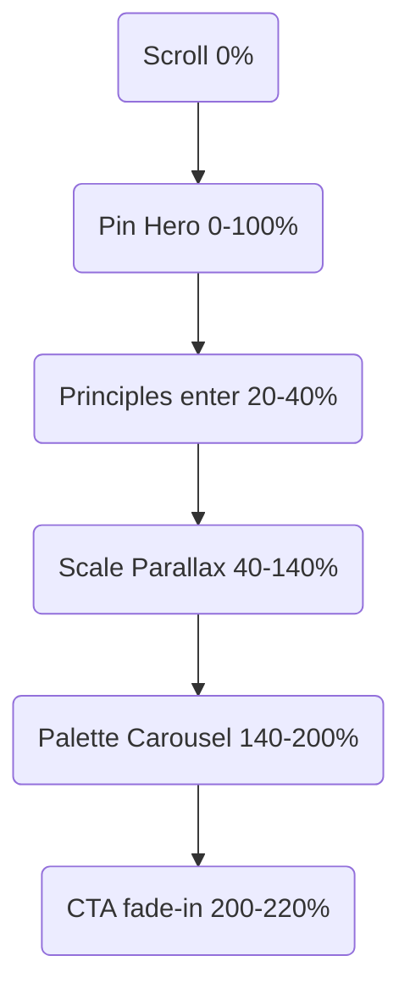

# Dropbox Brand Site Clone: End-to-End Motion \& Scroll-Trigger Blueprint

The following master plan breaks down every architectural, tooling, and implementation decision required to faithfully clone the interactive motion experience seen on Dropbox’s Brand Guidelines site. It is organized chronologically—from environment setup to pixel-perfect performance tuning—and details both GSAP + ScrollTrigger and Framer Motion tracks so you can choose the stack that best suits your team.

## Overview

Dropbox’s brand microsite uses scroll-synchronized text swaps, pinned sections, subtle parallax, and playful component transitions to keep visitors engaged. Rebuilding this experience demands:

- A declarative component tree that maps 1:1 to visual “chapters” on the page.
- Hook-driven scroll state to drive animations without wasteful global listeners.
- Robust animation timelines (GSAP) or motion values (Framer) that can be scrubbed, pinned, and snapped as the user scrolls.
- Thoughtful cleanup and performance safeguards to maintain 60 FPS across devices.

The remainder of this document covers each requirement in depth, with code, diagrams, and decision tables.

## Project Foundations

### Tech-Stack Matrix

| Concern | Preferred Library | Why | Key APIs | Alt-Option |
| :-- | :-- | :-- | :-- | :-- |
| Scroll-linked animation | GSAP + ScrollTrigger[^1] | Mature ecosystem, granular control, pin \& snap built in | `gsap.timeline`, `ScrollTrigger.create`, `scrub`, `pin`, `snap` | Framer Motion’s `useScroll` \& `whileInView`[^2] |
| Element visibility | `useIntersectionObserver` custom hook[^3] | Native API, 0-cost when off-screen, perfect for lazy-loading heavy assets | `IntersectionObserver`, `rootMargin`, `threshold` | Polling scroll listeners (avoid) |
| Global state | React Context | Pass scroll direction, active “chapter”, prefers-reduced-motion flag | `createContext`, `useContext` | Redux/ Zustand if large app |
| Animation definition | TypeScript + typed configs | Eliminates runtime typos in animation names \& easing | `type TimelineCfg = { from: … to: … }` | JS if prototype |
| Asset animation (SVG/shape morph) | GSAP CSSRulePlugin or Rive runtime[^4] | Dropbox uses Rive for micro-looping logos; GSAP can replicate simple cases | `CSSRulePlugin`, `RivePlayer` | Lottie |

## Folder Structure

```
/src
  /animations   // gsap or framer hooks & timelines
  /components   // React components per section
  /hooks        // useScrollPosition, useParallax, etc.
  /layout       // global layout + Header/Footer
  /styles       // SCSS modules or Tailwind layers
  /assets       // svg, png, rive files
```


## Phase 1 – Environment \& Baseline Layout

### 1. Install Dependencies

```bash
pnpm add react react-dom typescript
pnpm add gsap @gsap/scroll-trigger      # GSAP track
pnpm add framer-motion                  # Framer track
pnpm add @types/gsap                    # TS typings
pnpm add usehooks-ts                    # Ready-made intersection & scroll hooks[^41]
```


### 2. Global Styles

1. Reset CSS and set `scroll-behavior: smooth;` for hash links.
2. Apply Dropbox brand fonts (“Sharp Grotesk”, “Atlas Grotesk”), weights per guideline.
3. Define CSS variables for the core palette—Electric Blue, Eggplant, etc.—to swap dynamically.

### 3. Page Skeleton

| Section ID | Visual Purpose | Interaction |
| :-- | :-- | :-- |
| `hero` | Massive stacked “Our motion is fresh …” headline[^5] | Scroll fades each word sequentially |
| `principles` | Four motion principles grid | Cards rise \& alpha-in on view |
| `scale` | Sticky canvas + parallax illustrations | Pinned between start/end, scrubbed |
| `palette` | Color tokens carousel | Snap between swatches |
| `cta` | “Download kit” callout | Button magnetic hover |

Create each as `<Section id="hero">` etc., exporting `ref` and size props for ScrollTrigger alignment.

## Phase 2 – Custom Scroll Hooks

### 1. `useScrollPosition`

> Tracks x/y pixel offset, velocity, and direction with throttled `requestAnimationFrame` updates to avoid re-render storms[^6].

```tsx
export const useScrollPosition = () => {
  const [pos, setPos] = useState({x:0, y:0});
  const prev = useRef(0);
  useLayoutEffect(() => {
    let rId:number;
    const handle = () => {
      const y = window.scrollY;
      setPos({x: window.scrollX, y});
      prev.current = y;
      rId = requestAnimationFrame(handle);
    };
    handle();
    return () => cancelAnimationFrame(rId);
  }, []);
  return {
    ...pos,
    dir: pos.y > prev.current ? 'down' : 'up',
    vel: pos.y - prev.current
  };
};
```


### 2. `useInViewOnce`

> Wraps IntersectionObserver with `once:true` semantics for one-time entrance animations.

```tsx
export const useInViewOnce = (options:init) => {
  const ref = useRef<Element|null>(null);
  const [visible, set] = useState(false);
  useEffect(()=>{ if(!ref.current) return;
    const io = new IntersectionObserver(
      ([e]) => { if(e.isIntersecting){ set(true); io.disconnect(); } }, options);
    io.observe(ref.current);
    return () => io.disconnect();
  },[options]);
  return [ref, visible] as const;
};
```


## Phase 3 – Animation Track ① GSAP + ScrollTrigger

### 1. Shared `useGsapContext` Wrapper

```tsx
export const useGsap = (
  callback:(ctx:gsap.Context) => gsap.Timeline|void,
  deps:DependencyList=[]
)=>{
  const el = useRef<HTMLDivElement>(null);
  useLayoutEffect(()=>{
    let ctx:gsap.Context;
    if(el.current){
      ctx = gsap.context(callback, el);
    }
    return () => ctx?.revert();
  }, deps);
  return el;
};
```


### 2. Hero Headline Scrub

```tsx
export const Hero = () => {
  const ref = useGsap(ctx=>{
    const words = ctx.selector('.word');
    gsap.fromTo(words,
      {yPercent:0, opacity:1},
      {yPercent:-150, opacity:0, stagger:0.15,
       scrollTrigger:{
         trigger:ctx.selector('.container'),
         start:'top top',
         end:'+=100%',
         scrub:0.8,
         pin:true
       }}
    );
  },[]);
  return (
    <section ref={ref} className="container">
      {['Our','motion','is','fresh'].map(w=>(
        <h1 key={w} className="word">{w}</h1>
      ))}
    </section>
  );
};
```


#### Key Concepts

- **Pin** keeps the headline fixed while words animate out.
- **Scrub** ties timeline progress to scroll[^1].
- **Stagger** replicates sequential text shift.


### 3. Principles Card Reveal

```tsx
export const Principles = () => {
  const ref = useGsap(ctx=>{
    gsap.utils.toArray('.card').forEach(card => {
      gsap.from(card, {
        y:60, autoAlpha:0, duration:0.6,
        scrollTrigger:{trigger:card, start:'top 85%'}
      });
    });
  },[]);
  return (
    <section ref={ref} className="grid">
      {/* …cards */}
    </section>
  );
};
```


### 4. Scale Section Parallax

Pinned container with layered SVG sprites at different x/y factors:

```tsx
gsap.to('#layer-front',{ yPercent:-20,
  scrollTrigger:{trigger:section,start:'top top',end:'+=200%',scrub:true,pin:true} });
gsap.to('#layer-mid',{ yPercent:-10, scrollTrigger:{…} });
gsap.to('#layer-back',{ yPercent:-5,  scrollTrigger:{…} });
```


### 5. Snap Carousel

Set `snap:{snapTo:1/(n-1), duration:{min:0.2,max:1}}` on the timeline controlling horizontal translate so colors lock neatly[^1].

## Phase 4 – Animation Track ② Framer Motion

If you prefer declarative motion, mirror the GSAP choreography with Framer:

### 1. Hero Variant Sequence

```tsx
const words = ['Our','motion','is','fresh'];
export const Hero = () => {
  const {scrollYProgress} = useScroll();
  return (
    <section className="sticky">
      {words.map((w,i)=>(
        <motion.h1 key={w}
            style={{y:scrollYProgress.interpolate([i*0.1,(i+1)*0.1],[0,-150])}}
            initial={{opacity:1}} />
      ))}
    </section>
  );
};
```


### 2. In-View Grid

```tsx
<motion.div
  variants={{hidden:{y:60,opacity:0},show:{y:0,opacity:1}}}
  initial="hidden"
  whileInView="show"
  viewport={{once:true,amount:0.6}}
/>
```


### 3. Scroll-Linked Parallax

```tsx
const {scrollYProgress} = useScroll({target:sectionRef});
const yBack  = useTransform(scrollYProgress,[0,1],['0%','-5%']);
const yFront = useTransform(scrollYProgress,[0,1],['0%','-20%']);
<motion.svg style={{y:yBack}} />
<motion.svg style={{y:yFront}} />
```


### 4. Snap Behavior

Framer lacks built-in snapping; wrap `scroll` event, compute nearest break, and `scrollTo` programmatically or integrate with CSS `scroll-snap-type`.

## Phase 5 – Component Position \& Layout Math

### Pinning Strategy Table

| Section | Pin? | Start | End | Rationale |
| :-- | :-- | :-- | :-- | :-- |
| Hero | `true` | `top top` | `+=100%` | Keep headline visible during text exit |
| Scale | `true` | `top top` | Content height ×2 | Allows 2× scroll space for parallax |
| Palette | `false` | - | - | Natural flow, rely on snap carousel |

Calculate dynamic heights with CSS `min-height:100vh` and `ScrollTrigger.refresh()` on resize[^1].

### Z-Index Map

| Layer | z-index | Notes |
| :-- | :-- | :-- |
| Header sticky | 999 | fades on scroll direction[^2] |
| Pinned sections | 100 | sits above regular flow |
| Backdrop shapes | -1 | absolute positioning |

## Phase 6 – Asset \& Micro-interaction Guidelines

1. **Rive Assets:** Import `.riv` files \& play via `<Rive src="...riv" autoplay loop />`. If unavailable, animate SVG with GSAP MorphSVG.
2. **Iconography:** Import Dropbox’s minimal line icons, animate stroke-dashoffset on hover to trace lines.
3. **Magnetic Buttons:** On pointermove, measure delta from center, update `gsap.to(button,{x:dx*0.3,y:dy*0.3})`. Reset on leave.

## Phase 7 – Performance \& Accessibility

### Checklist

- **Reduce Layout Thrash:** Animate transforms and opacity exclusively[^1].
- **Prefers-Reduced-Motion:** Wrap animations in media query:

```css
@media (prefers-reduced-motion: reduce) { .anim { animation: none !important; } }
```

- **Lazy-load Heavy Sections:** Combine `Suspense` with `useInViewOnce` to import GSAP timelines only when needed.
- **Debounce Resizes:** `ScrollTrigger.config({autoRefreshEvents:'visibilitychange,DOMContentLoaded,load'})`.
- **Cleanup:** Always `ctx.revert()` or `scrollTrigger.kill()` in `useEffect` return to avoid memory leaks[^7].


## Phase 8 – QA \& Tuning

1. Enable `ScrollTrigger` markers during development `markers:true` to debug start/end points[^1].
2. Record scroll performance in Chrome DevTools: ensure main thread remains <10 ms per frame.
3. Test at 320 px width; adjust `matchMedia`:
```js
ScrollTrigger.matchMedia({
  "(max-width: 768px)": () => {/* simpler animations */},
  "(min-width: 769px)": () => {/* full */},
});
```

4. Verify screen reader flow; pinning should not break DOM order.

## Appendix A – GSAP vs Framer Decision Table

| Criterion | GSAP + ScrollTrigger | Framer Motion |
| :-- | :-- | :-- |
| Learning curve | Medium (imperative) | Low (declarative) |
| Pin \& snap out-of-box | Yes[^1] | Pin: limited, Snap: manual |
| Timeline sequencing | Industry-leading[^8] | Basic w/ variants |
| Code splitting | Possible via `gsap.registerPlugin` | Built-in tree-shaking |
| Touch device smoothness | Excellent; ScrollSmoother optional | Good; value spring smoothing |
| File size (min gzip) | ~70 kB (core+ScrollTrigger) | ~64 kB |
| When to choose | Complex scrubbing \& pinning | Simpler in-view reveals |

## Appendix B – Reference Hook Library Index

| Hook | Purpose | Source |
| :-- | :-- | :-- |
| `useScrollPosition` | Global scroll pos \& direction | Derived from CloudDevs article[^6] |
| `useIntersectionObserver` | Element visibility | usehooks-ts[^3] |
| `useGsap` | Scoped context \& cleanup | GSAP React patterns[^7] |
| `useParallax(layer, factor)` | Returns transform style tied to ScrollTrigger | Custom |

## Appendix C – Timeline Blueprint Snapshot



Each node represents a ScrollTrigger instance with start/end boundaries.

## Closing Notes

By combining structured section components, efficient scroll hooks, and either GSAP + ScrollTrigger’s battle-tested timeline mechanics or Framer Motion’s declarative scroll hooks, you can replicate Dropbox’s delightful brand-site movements with pixel-accuracy while maintaining performance and accessibility. Align your pinning math, scrub the timelines, and test under reduced-motion settings to ensure every visitor enjoys a fast, engaging ride through your cloned experience.

<div style="text-align: center">⁂</div>

[^1]: https://gsap.com/docs/v3/Plugins/ScrollTrigger/

[^2]: https://motion.dev/docs/react-scroll-animations

[^3]: https://stackoverflow.com/questions/58341787/intersectionobserver-with-react-hooks

[^4]: https://rive.app/blog/dropbox-launches-interactive-brand-guidelines-site-using-rive

[^5]: https://brand.dropbox.com/motion

[^6]: https://gsap.com/resources/react-basics/

[^7]: https://www.rustcodeweb.com/2024/04/gsap-best-practices.html

[^8]: https://stackoverflow.com/questions/68246341/how-to-connect-timeline-in-gsap-react-for-different-elements

[^9]: https://brand.dropbox.com

[^10]: https://blog.logrocket.com/react-scroll-animations-framer-motion/

[^11]: https://stackoverflow.com/questions/72669051/react-hook-for-page-scroll-position-causing-re-renders-on-scroll

[^12]: https://itnext.io/1v1-scroll-listener-vs-intersection-observers-469a26ab9eb6

[^13]: https://www.loubagel.com/blog/getting-started-with-gsap-scrolltrigger/

[^14]: https://dev.to/shivamkatare/create-beautiful-scroll-animations-using-framer-motion-1a7b

[^15]: https://www.creativebloq.com/design/dropboxs-new-brand-identity-website-puts-boring-style-guides-to-shame

[^16]: https://hackernoon.com/setting-scroll-position-in-react

[^17]: https://dev.to/koolkamalkishor/enhancing-website-performance-with-intersection-observer-f89

[^18]: https://www.youtube.com/watch?v=PrQeeUt49f4

[^19]: https://www.framer.com/academy/lessons/scroll-animations

[^20]: https://www.commarts.com/webpicks/dropbox-brand-guidelines

[^21]: https://dev.to/fpaghar/get-and-set-the-scroll-position-of-an-element-with-react-hook-4ooa

[^22]: https://stackoverflow.com/questions/55867849/one-intersectionobserver-to-observe-many-elements-or-one-intersectionobserver-pe

[^23]: https://cbae.tistory.com/16

[^24]: https://github.com/n8tb1t/use-scroll-position

[^25]: https://sooros.com/Improving-table-performance-using-intersectionObserver

[^26]: https://webdesignerdepot.com/dropbox-unveils-new-brand-identity-microsite/

[^27]: https://usehooks-ts.com/react-hook/use-scroll-lock

[^28]: https://www.youtube.com/watch?v=alGnk3iMaYE

[^29]: https://discourse.webflow.com/t/how-to-make-webflow-animations-work-in-react/174413

[^30]: https://velog.io/@ki2183/React에서-gsap-ScrollTrigger을-사용해보았다

[^31]: https://dev.to/dagasatvik10/react-usescrollto-hook-3263

[^32]: https://www.youtube.com/watch?v=DWio4NCIdeQ

[^33]: https://www.youtube.com/watch?v=XOIU3mdR9Sc

[^34]: https://bitworking.github.io/react-gsap/src-components-scroll-trigger/

[^35]: https://velog.io/@taeung/React-Custom-Hooks로-Scroll-Event-구현하기

[^36]: https://gsap.com/community/forums/topic/30484-horizontal-scroll-parallax-responsive-using-scrolltrigger-react/

[^37]: https://www.youtube.com/watch?v=LL7Yl7XqPsI

[^38]: https://www.geeksforgeeks.org/reactjs/greensock-scrolltrigger-with-reactjs/

[^39]: https://gonii328.tistory.com/45

[^40]: https://blog.olivierlarose.com/tutorials/parallax-scroll

[^41]: https://webflow.com/interactions-animations

[^42]: https://clouddevs.com/react/usescrollposition-hook/

[^43]: https://usehooks-ts.com/react-hook/use-intersection-observer

[^44]: https://lo-victoria.com/a-look-at-react-hooks-usescrollposition-for-parallax-scrolling-effects

[^45]: https://www.npmjs.com/package/react-intersection-observer-hook

[^46]: https://gsap.com/resources/getting-started/timelines/

[^47]: https://usehooks.com/useintersectionobserver

[^48]: https://www.npmjs.com/package/react-use-scroll-position

[^49]: https://velog.io/@devstefancho/React-IntersectionObserver으로-hooks만들기-infinite-scroll

[^50]: https://javascript.plainenglish.io/react-functions-gsap-timelines-and-hooks-oh-my-ec7620b6bdc6

[^51]: https://designcode.io/react-hooks-handbook-usescrollposition-hook/

[^52]: https://velog.io/@sangbooom/React-유용한-useIntersectionObserverOnce-hook

[^53]: https://gsap.com/community/forums/topic/41162-calling-multiple-timelines-rapidly-best-practices/

[^54]: https://velog.io/@kimbangul/React-useScroll-커스텀-hook

[^55]: https://github.com/thebuilder/react-intersection-observer

